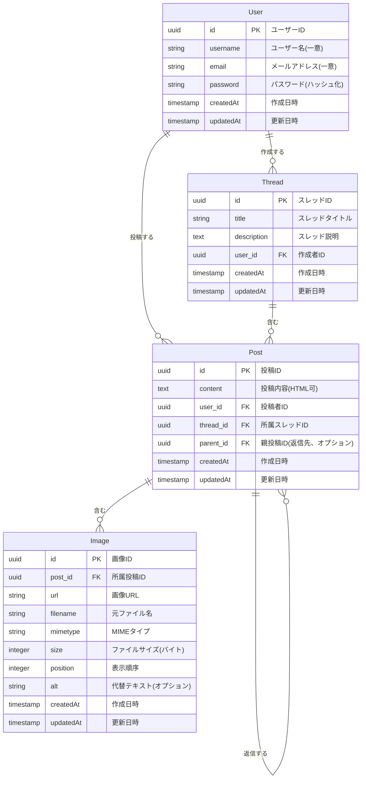

# スレッド型掲示板アプリケーション

モノレポ構成で作成された、スレッド型掲示板のWebアプリケーションです。NestJS、Next.js、PostgreSQLを使用しています。

## システム構成

このプロジェクトは以下のコンポーネントで構成されています：

- **フロントエンド**: Next.js (TypeScript)
  - ポート: 3001
  - URL: http://localhost:3001
- **バックエンド**: NestJS (TypeScript)
  - ポート: 3000
  - API URL: http://localhost:3000
  - Swagger API ドキュメント: http://localhost:3000/api
- **データベース**: PostgreSQL 16
  - ポート: 5432
  - データベース名: threadboard
  - ユーザー名: postgres
  - パスワード: postgres

## 起動方法

### Docker Compose を使用した起動 (推奨)

プロジェクトルートディレクトリで以下のコマンドを実行するだけで、フロントエンド、バックエンド、PostgreSQLが一緒に起動します：

```bash
# すべてのサービスを起動
$ docker compose up

# バックグラウンドで起動する場合
$ docker compose up -d

# 変更を加えた後に再ビルドして起動する場合
$ docker compose up --build
```

### 個別の起動方法

プロジェクトのルートディレクトリから以下のコマンドを実行できます：

```bash
# バックエンドのみを起動 (Docker経由)
$ npm run backend

# フロントエンドのみを起動
$ npm run frontend

# バックエンドとフロントエンドを同時に起動 (別々のターミナルで)
$ npm run dev
```

## 機能一覧

1. ユーザー管理機能

   - ユーザー登録
   - ユーザー認証（ログイン）
   - 認証ユーザー情報取得

2. スレッド管理機能

   - スレッド作成
   - スレッド一覧取得
   - スレッド詳細取得

3. 投稿管理機能
   - 投稿作成
   - 投稿一覧取得（スレッド単位）
   - 投稿への返信
   - 返信一覧取得（投稿単位）

## プロジェクト構造

```
/
├── docker-compose.yml           # Docker Compose 設定ファイル
├── packages/                    # モノレポのパッケージディレクトリ
│   ├── backend/                 # NestJS バックエンド
│   │   ├── Dockerfile          # バックエンド用 Dockerfile
│   │   └── ...
│   └── frontend/               # Next.js フロントエンド
│       ├── Dockerfile          # フロントエンド用 Dockerfile
│       └── ...
└── ...
```

## 開発環境のセットアップ

### 前提条件

- Docker と Docker Compose がインストールされていること
- Node.js と npm がインストールされていること (Docker を使わない場合)

### 初回セットアップ

```bash
# リポジトリをクローン
$ git clone <repository-url>
$ cd <repository-directory>

# Docker Compose で起動
$ docker compose up
```

アプリケーションは以下のURLでアクセスできます：

- フロントエンド: http://localhost:3001
- バックエンドAPI: http://localhost:3000
- API仕様(Swagger): http://localhost:3000/api

## データベース設計

### ER図



### 接続情報

データベース接続情報は主に以下のファイルで設定しています：

1. **docker-compose.yml**

   - PostgreSQLサービスの設定
   - データベース名：`threadboard`
   - ユーザー名：`postgres`
   - パスワード：`postgres`
   - ポート：`5432`

2. **packages/backend/src/app.module.ts**
   - TypeORMの設定
   - 環境変数から接続情報を取得（Docker環境変数経由）
   - エンティティの登録

### テーブル・カラム定義

テーブルとカラムの定義は、Domain層のエンティティクラスで行われています：

1. **packages/backend/src/domain/users/entities/user.entity.ts**

   - `users`テーブルの定義
   - カラム：`id`, `username`, `email`, `password`, `createdAt`, `updatedAt`
   - リレーション：Thread（1対多）, Post（1対多）

2. **packages/backend/src/domain/threads/entities/thread.entity.ts**

   - `threads`テーブルの定義
   - カラム：`id`, `title`, `description`, `createdAt`, `updatedAt`
   - リレーション：User（多対1）, Post（1対多）

3. **packages/backend/src/domain/posts/entities/post.entity.ts**

   - `posts`テーブルの定義
   - カラム：`id`, `content`, `createdAt`, `updatedAt`
   - リレーション：User（多対1）, Thread（多対1）, Parent Post（多対1、自己参照）, Image（1対多）

4. **packages/backend/src/domain/images/entities/image.entity.ts**
   - `images`テーブルの定義
   - カラム：`id`, `url`, `filename`, `mimetype`, `size`, `position`, `alt`, `createdAt`, `updatedAt`
   - リレーション：Post（多対1）

## ライセンス

[MIT licensed](LICENSE)
